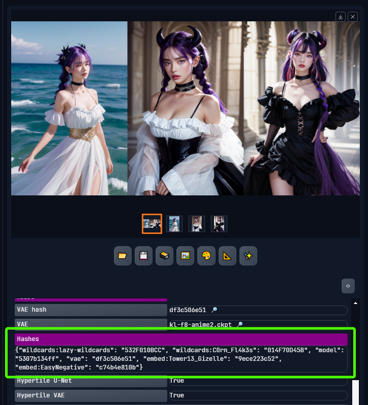
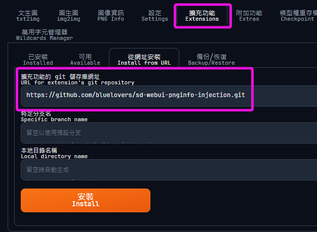

# README.md

    Stable Diffusion PNGINFO Injection extension

    此擴充套件能夠將更多的 PNGINFO 欄位加入到 Stable Diffusion WebUI 所產生的 PNG 檔案中，例如 Civitai 資源的雜湊值。
    This extension can add more PNGINFO fields to the PNG files generated by Stable Diffusion WebUI, such as the hash values of Civitai resources.
    この拡張機能は、Stable Diffusion WebUIによって生成されたPNGファイルに、Civitaiリソースのハッシュ値など、さらにPNGINFOフィールドを追加できます。

https://github.com/bluelovers/sd-webui-pnginfo-injection




## Install

To install in the WebUI, clone this repository under `Extensions` -> `Install from URL` by simply copy and paste here

```
https://github.com/bluelovers/sd-webui-pnginfo-injection.git
```



