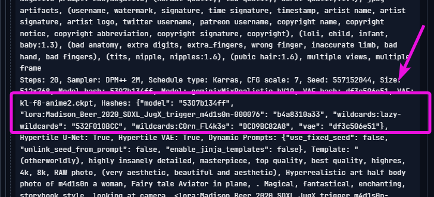
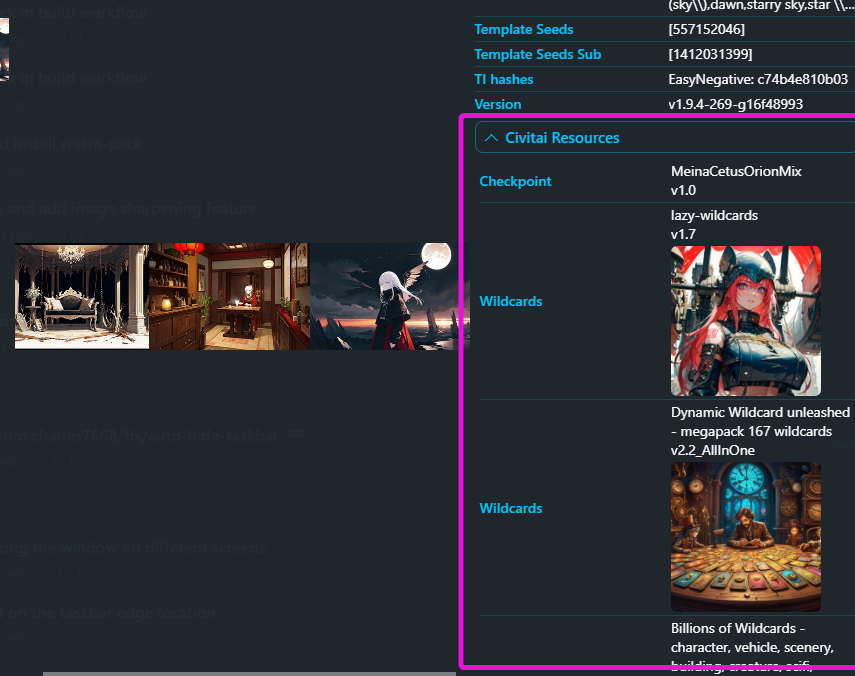
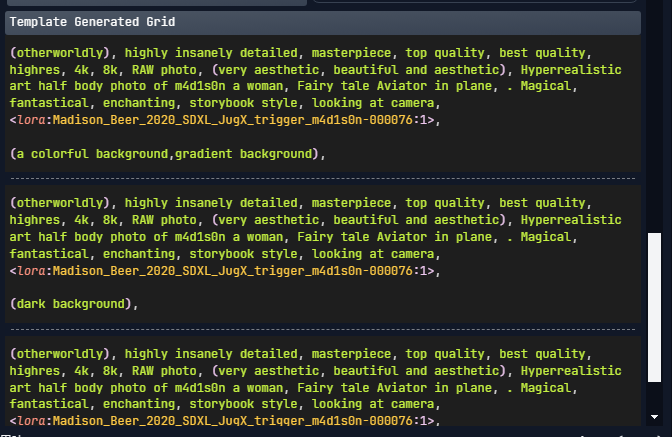
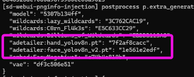
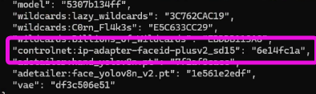

# README.md

    Stable Diffusion PNGINFO Injection extension

此擴充套件能夠將更多的 PNGINFO 欄位加入到 Stable Diffusion WebUI 所產生的 PNG 檔案中，例如 Civitai 資源的雜湊值。

This extension can add more PNGINFO fields to the PNG files generated by Stable Diffusion WebUI, such as the hash values of Civitai resources.

この拡張機能は、Stable Diffusion WebUIによって生成されたPNGファイルに、Civitaiリソースのハッシュ値など、さらにPNGINFOフィールドを追加できます。

https://github.com/bluelovers/sd-webui-pnginfo-injection

## Field Injection

### `Hashes`

> for https://civitai.com/

When uploading images on Civitai, although the modules used are automatically detected, there are still some omissions. By using the Hashes field, you can actively let Civitai know what resources were used.

> in civitai upload image


> with a1111 raw



> with [sd-webui-pnginfo-beautify](https://github.com/bluelovers/sd-webui-pnginfo-beautify)


> with [Tiefsee](https://github.com/hbl917070/Tiefsee4)



### `Template Generated Grid` , `Template Generated`, `Wildcard Prompt`

> for `sd-dynamic-prompts`

WIP (Work In Progress).

> with [sd-webui-pnginfo-beautify](https://github.com/bluelovers/sd-webui-pnginfo-beautify)



### ADetailer (After Detailer)

- https://feedback.civitai.com/p/should-add-adetailer-type-or-allow-upload-pt-safetensors-in
- https://github.com/Bing-su/adetailer/issues/675



### ControlNet



## Install

To install in the WebUI, clone this repository under `Extensions` -> `Install from URL` by simply copy and paste here

```
https://github.com/bluelovers/sd-webui-pnginfo-injection.git
```


