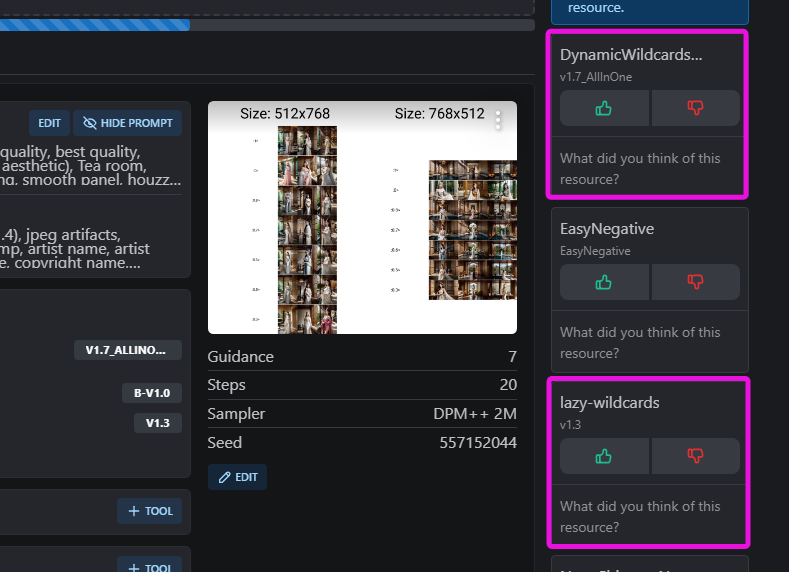

# README.md

    Stable Diffusion PNGINFO Injection extension

此擴充套件能夠將更多的 PNGINFO 欄位加入到 Stable Diffusion WebUI 所產生的 PNG 檔案中。這些額外資訊包括了您所使用的 Civitai 資源（例如 Wildcards、controlnet、ADetailer 與其他等模型）的雜湊值。

This extension can add more PNGINFO fields to the PNG files generated by Stable Diffusion WebUI. This additional information includes the hash values of the Civitai resources (such as Wildcards, controlnet, ADetailer, and other models) that you used.

この拡張機能は、Stable Diffusion WebUI が生成する PNG ファイルに、より多くの PNGINFO フィールドを追加することができます。これらの追加情報には、あなたが使用した Civitai リソース（Wildcards、controlnet、ADetailer、その他のモデルなど）のハッシュ値が含まれます。

이 확장 프로그램은 Stable Diffusion WebUI에서 생성된 PNG 파일 ​​에 더 많은 PNGINFO 필드를 추가할 수 있습니다. 이 추가 정보에는 사용한 Civitai 리소스(예: Wildcards, controlnet, ADetailer 및 기타 모델)의 해시 값이 포함됩니다.

https://github.com/bluelovers/sd-webui-pnginfo-injection

## Pull Request Wellcome

我們誠摯歡迎您提交 Pull Request ！您的貢獻將幫助我們增加更多判定功能。

Pull Requests are welcome! Your contributions will help us add more judgment functions.

Pull Request は大歓迎です！あなたの貢献は、より多くの判断機能を追加するのに役立ちます。

Pull Request 환영합니다! 귀하의 기여는 더 많은 판단 기능을 추가하는 데 도움이 될 것입니다.

- https://github.com/bluelovers/sd-webui-pnginfo-injection/blob/master/sd_webui_pnginfo_injection/bundle_hashes.py#L49

**特別注意：** 檔案中項目之間的 `#` 註解符號 **務必保留**。這些註解對於使用 Git 版本控制系統進行合併時，能提供重要的資訊，有助於減少合併衝突。

**Note：** Please ensure that the `#` comment markers between items are preserved. These comments provide important information for Git when merging changes, helping to reduce conflicts.

**特別注意：** 上記のファイルを編集してください。項目間の `#` コメントは必ず残してください。これらのコメントは、Git での変更のマージをよりスムーズに行うために役立ちます。

**참고：** 항목 사이의 `#` 주석 표시는 유지해야 합니다. 이러한 주석은 변경 사항을 병합할 때 Git에 중요한 정보를 제공하여 충돌을 줄이는 데 도움이 됩니다.

## Field Injection

### `Hashes`

> for https://civitai.com/

When uploading images on Civitai, although the modules used are automatically detected, there are still some omissions. By using the Hashes field, you can actively let Civitai know what resources were used.

> in civitai upload image



> with a1111 raw


> with [sd-webui-pnginfo-beautify](https://github.com/bluelovers/sd-webui-pnginfo-beautify)


> with [Tiefsee](https://github.com/hbl917070/Tiefsee4)


### `Template Generated Grid` , `Template Generated`, `Wildcard Prompt`

> for `sd-dynamic-prompts`

WIP (Work In Progress).

> with [sd-webui-pnginfo-beautify](https://github.com/bluelovers/sd-webui-pnginfo-beautify)


### ADetailer (After Detailer)

- https://feedback.civitai.com/p/should-add-adetailer-type-or-allow-upload-pt-safetensors-in
- https://github.com/Bing-su/adetailer/issues/675


### ControlNet


## Install

To install in the WebUI, clone this repository under `Extensions` -> `Install from URL` by simply copy and paste here

```
https://github.com/bluelovers/sd-webui-pnginfo-injection.git
```


